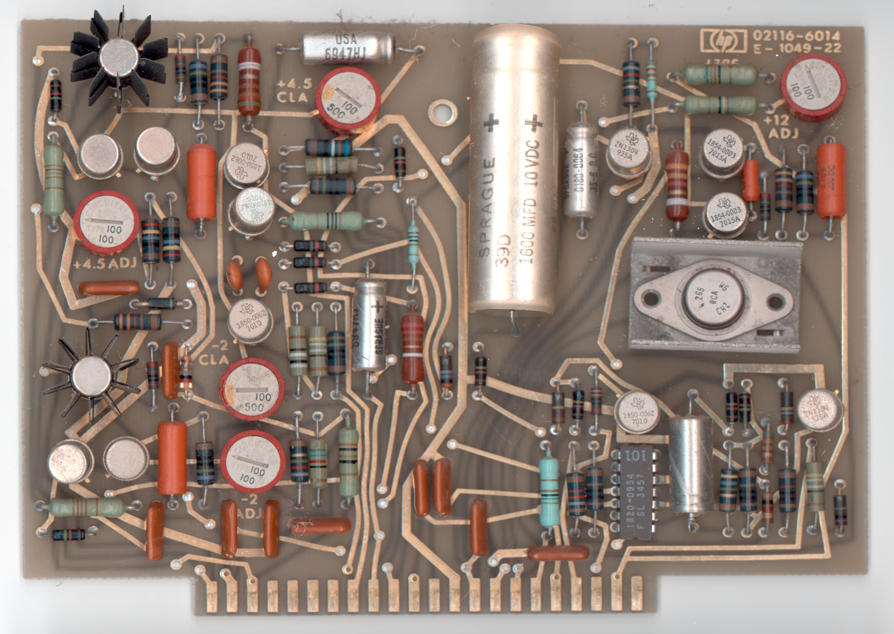
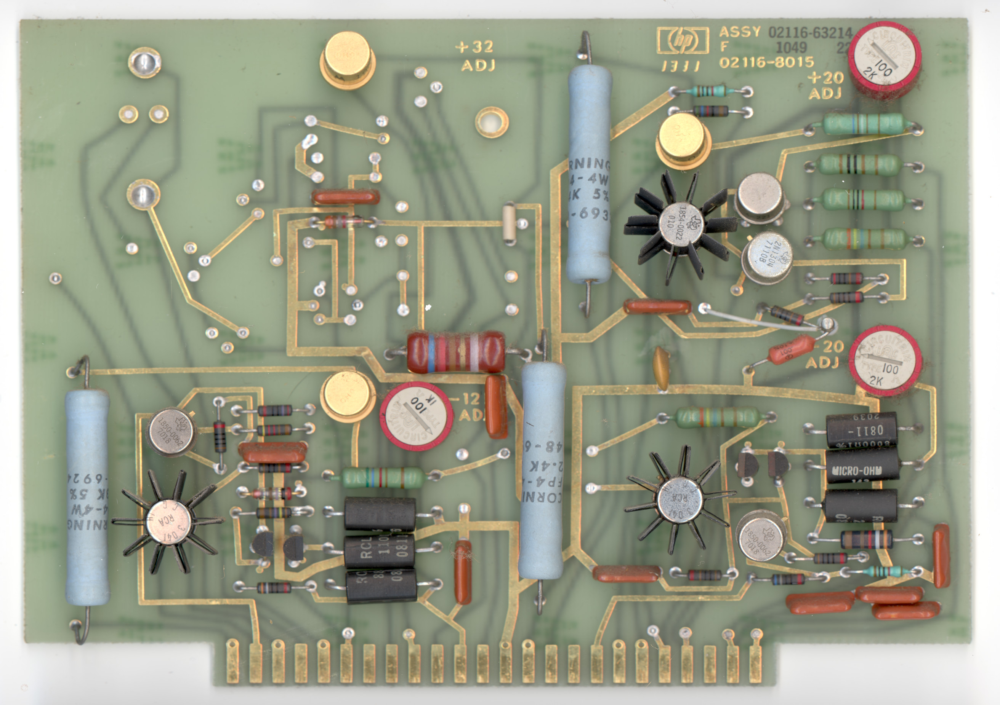
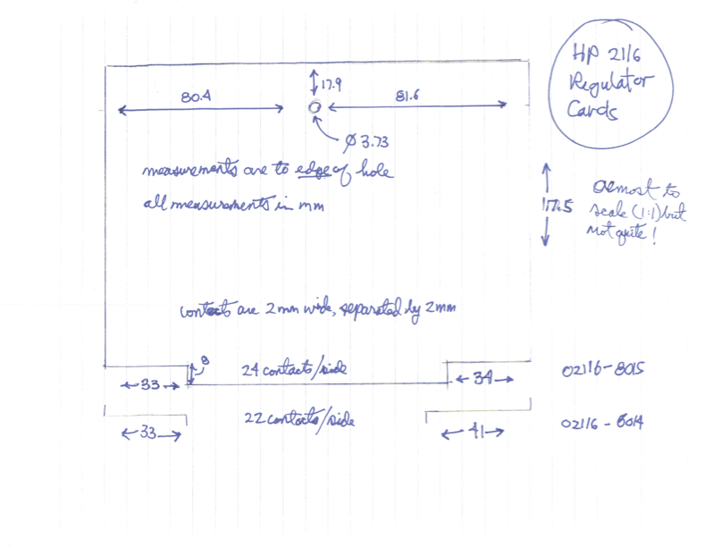
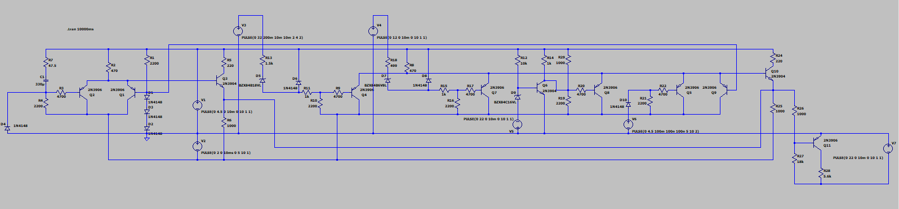
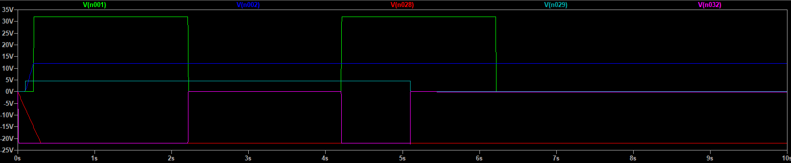
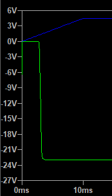
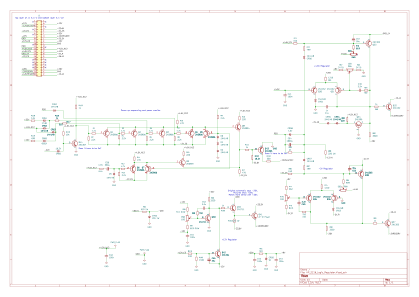
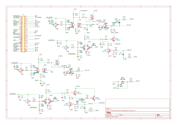

# HP2116_regulators
A project to create replicas of the two voltage regulator boards of the HP2116.

Unfortunately my HP 2116B which I was able to rescue from destruction in the fall of 2025 was missing not just two logic boards (of which one I was able to buy on Ebay later) but also two very important small regulator boards. The purpose of these two boards is to control the generation of all the voltages needed by the computer.

Finding the exact boards will probably take quite long time if at all possible.

A fellow collector took photos of the boards in his HP 2116C machine. They are very similar except for the memorys regulator not supplying a 32V so those components are not populated.

He also took some measurements of the boards

Thank you Jack! With this I will be able to create boards that fit the machine correctly.

I will be facing a number of problems when doing this. For example there are extensive use of really old Germanium transistors used. The reason for this is partly because of the low Vbe forward voltage. These transistors are used in the current sense circuit basically sitting with the B and E over the current sense resistor. The start to conduct over 0.2V and thus limiting or shutting down the power supply if there are excess current. This circuit with these specifcations wouldn't work with Silicon transistors.

Then the Logic Regulator board are using the Fairchild CTL chip family for logic functions and sequencing of the voltages in the power supply. I thought about replacing it with a corresponding TTL circuit but then the problem is that I don't really now how the TTL circuit react when low voltages are used. I.e. when the power supply is starting up. CTL is basically emitter coupled logic and I came to the conclusion that it would be possible to replicate the functionality using discrete NPN and PNP transistors. Tieing together the emitters of PNP transistors creates AND gates while tieing togther emitters of NPN transistors creates OR gates.

I simulated this design in LTSpice and came to the conclusion that it will likely work as the original circuit using the integrated CTL chip.

The waveforms of the power monitor

Green is the simulated +32V. Delayed and then goes out after about 2 seconds. Blue is the +12V that power up slowly. Red is the even slower -22V. The cyan signal is the 4.5V PSO signal that tells is there is a overheating condition. The resulting signal is the violet. It enables the -12V regulator when low and shuts it down when grounded. It looks like the logic is working.

In the picture below green is the signal to the -12V supply and the blue is the 4.5V power line.

Here is the schematic for the logic regulator.

And this is the memory regulator schematic.

At this point I have started to procure components. I managed to find the 2N1304 and 2N1305 germanium transistors from a vendor in the UK and the same company also had the 2N4044 matched pairs so now all the small resistors, zeners and caps need to be ordered and then I can start laying out the PCB. Care has to be taken so there is room for the heatsinks on the TO5. Both boards have a TO66 power transistor where the exact match is hard to find. I think a NPN TIP41 should be just fine since this just a simple emitter follower output stage to increase the drive power.
